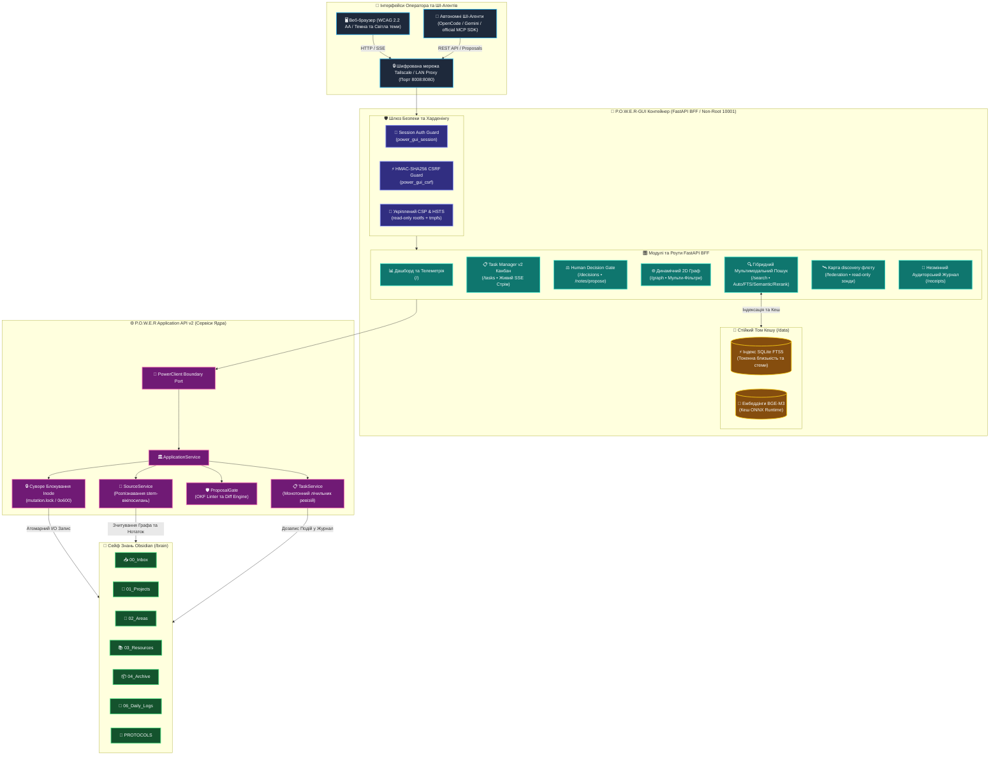

# 🧠 P.O.W.E.R-GUI

[🇺🇸 English](README.md) | [🇺🇦 Українська](README.ua.md)

[](https://hub.docker.com/r/webyhomelab/power-gui)
[](https://fastapi.tiangolo.com)
[](https://www.python.org)
[](https://github.com/weby-homelab/power-framework)
[](https://tailscale.com)
[](LICENSE)
[](AGENTS.md)


**P.O.W.E.R-GUI** — це security-focused, AI-native веб-кокпіт та центр прийняття рішень для вашої персональної бази знань [Obsidian](https://obsidian.md) (Second Brain). Додаток розроблено як **Docker-First** candidate із документованим native-профілем, він поєднує оператора-людину та автономних ШІ-агентів через екосистему **P.O.W.E.R Framework (P.A.R.A. + OKF v0.1 + Graph RAG + LLM-Wiki)**.

**Кандидат suite:** GUI `0.7.12` candidate проти POWER `3.7.4` у immutable фінальному public тегу `v3.7.4` коміт `13dd835be5f5a03b13cad4a627b0445b2451acf0` wheel `f12ad02097448cd1b7663fc79681481013637d011ecde25a9085a899beb547e2` та контракту `power.application.v2` (Python `>=3.13,<3.15`). Це candidate worktree: signed tags, digest контейнера, SBOM/provenance, publication і live E2E readback залишаються явними release gates у [`compatibility.json`](compatibility.json). Публічна discovery-поверхня залишається experimental custom discovery; стабільні claims A2A та multi-writer Federation не підтримуються.

---

## 🏛️ Архітектура та Головні Принципи

P.O.W.E.R-GUI реалізує архітектурний патерн **Backend-For-Frontend (BFF)** на базі FastAPI та Pydantic v2 Settings. Додаток взаємодіє з базою знань виключно через канонічний інтерфейс `PowerClient` та `ApplicationService`, що гарантує повну відсутність невалідованих прямих перезаписів файлів на диску.



---

## ✨ Ключові Можливості

### 1. 🎨 Сучасна Дизайн-Система Тем (2026) та Інтернаціоналізація (i18n)
- **Lifted Dark Mode (За замовчуванням):** Глибокий графітово-синій фон (`#0b0f19`/`#131d31`) з м'якими градаціями яскравості та небесно-блакитними акцентами (`#38bdf8`).
- **Minimalist Light Mode:** Чистий фон slate-50 (`#f8fafc`), білі поверхні карток (`#ffffff`) та насичені океанічні блакитні акценти (`#0284c7`).
- **Перемикач тем `[ 🌙 | ☀️ ]`:** Миттєва зміна теми у верхній панелі навігації зі збереженням стану в cookie (`power_gui_theme`).
- **Багатомовність `[ ENG | UKR ]`:** Англійська мова встановлена базовою з можливістю швидкого перемикання на українську через панель навігації або роут `/set-lang`.

### 2. 🔒 Комплексна Безпека та Бар'єр Автентифікації
- **Обов'язковий Auth Middleware та Fail-Closed захист:** Неавторизований трафік до всіх приватних розділів (`/`, `/dashboard`, `/notes`, `/tasks`, `/decisions`, `/receipts`) автоматично перенаправляється на `/login` (303). За відсутності налаштованих облікових даних система надійно блокує вхід (500).
- **Константний час перевірки та сучасне хешування:** Підтримка константного часу порівняння через `secrets.compare_digest` та криптографічних хешів (PBKDF2-HMAC-SHA256, Argon2id, Bcrypt).
- **Захист від підбору (Brute-Force Lockout):** Обмеження невдалих спроб входу (ліміт 5 спроб у вікні часу) з прогресивним експоненційним блокуванням та моніторингом.
- **CSRF-захист на рівні запитів:** Double-submit / session-bound HMAC-SHA256 CSRF токени на всіх мутаційних POST-роутах (`/notes/propose`, `/notes/apply`, `/tasks/new`, `/tasks/{id}/transition`, `/decisions/{id}/resolve`, `/logout`, `/login`).
- **Ізольований контейнер та укріплений CSP:** Запуск під виділеним користувачем `10001:10001` зі скиданням прав `cap_drop: [ALL]`, `read_only` rootfs та політикою Content-Security-Policy, що замикає скрипти на `'self'` (без інлайн-скриптів), водночас дозволяючи інлайн-стилі через `'unsafe-inline'`.

### 3. 📋 Канонічний Task Manager v2 Cockpit
- **Інтерактивна Канбан-дошка:** Візуальне відстеження завдань по станах: `backlog` ➔ `ready` ➔ `working` ➔ `blocked` / `input-required` / `auth-required` ➔ `completed` / `failed`.
- **Монотонний контроль ревізій:** Захист від втрати паралельних оновлень за допомогою перевірки `expected_revision`.
- **Append-Only журнал подій:** Кожна зміна стану формує незмінну подію з хешем корисного навантаження (SHA-256).
- **Живий стрімінг у реальному часі:** Миттєва доставка подій у браузер через Server-Sent Events (`/tasks/api/events/stream`).

### 4. 🛡️ Транзакційний Редактор Нотаток та Proposal Gate
- **Human-in-the-Loop потік:** ШІ-агенти та користувачі вносять зміни через пропозиції (`Edit` ➔ `Propose` ➔ `OKF Linter Validation` ➔ `Human Approval` ➔ `Apply`).
- **Захист від випадкового затирання:** Будь-яка зміна перевіряється через diff-перегляд і фіксується аудиторським чеком (Receipt).
- **Розпізнавання Obsidian Wikilinks:** Автоматичне знаходження нотаток за базовою назвою (stem, наприклад `[[Infrastructure]]`) без вказування повного шляху до підпапки.

### 5. 🌐 Динамічний 2D Граф Знань (Force-Directed)
- Візуалізація зв'язків між нотатками за допомогою D3 force-directed алгоритму в реальному часі.
- Підтримка глобального поноекранного перегляду сейфу та локальних 2-рівневих піддерев для окремих документів.
- **Інтерактивні мульти-фільтри:** Миттєвий пошук нотаток, перемикачі категорій (`01_Projects`, `02_Areas`, `03_Resources`, `04_Archive`, `06_Daily_Logs`, `Other`), повзунок ступеня зв'язності (degree) та перемикач ізольованих вузлів-сиріт (orphan toggle).
- **Доступність WCAG 2.2 AA:** Таблична альтернатива з високим контрастом для екранних читачів та клавіатурної навігації.

### 6. 🔍 Мультимодальний Гібридний Пошук
- Миттєве перемикання між 4 режимами пошуку:
  - `Auto`: Гібридний щільний семантичний пошук із повнотекстовим fallback.
  - `FTS`: Швидкий повнотекстовий BM25-пошук із токенною близькістю та стійким SQLite FTS-кешем.
  - `Semantic`: Семантичні ембеддінги (наприклад, `BGE-M3` 1024d).
  - `Reranked`: Переранжування через cross-encoder для складних контекстних запитів.
- Підтримка фільтрації за тегами (`tag:`) та префіксами шляхів (`prefix:`) з авто-розігрівом кешу при старті контейнера.

### 7. 🛰️ Карта discovery флоту та read-only зонди
- Моніторинг вузлів homelab-флоту (PRXMX-01 Home Core, LXC 200 Docker Host, WS OpenCode AI Agent, HTZNR VPN Exit, PRXMX-02 Backup Host).
- Real-time HTTP/ping latency probes та health badges. Це **лише read-only discovery / probing** — не multi-writer federation і **не** заява про відповідність A2A 1.0.
- Runtime-метадані публікуються як `experimental/custom-discovery` (див. `/federation/agent.json`).

---

## 🐳 Розгортання в Docker (Основний Стандарт)

P.O.W.E.R-GUI є Docker-first і має підтримуваний native Linux user-service
профіль на базі керованого POWER venv та launcher `power-gui`.

### 1. Швидкий запуск однією командою

```bash
docker run -d \
  --name power-gui \
  --restart unless-stopped \
  --user 10001:10001 \
  --cap-drop ALL \
  --security-opt no-new-privileges:true \
  --read-only \
  --tmpfs /tmp:rw,noexec,nosuid,size=64m \
  -p 127.0.0.1:8008:8080 \
  -e POWER_GUI_AUTH_ENABLED=true \
  -e POWER_GUI_ADMIN_PASSWORD="${POWER_GUI_ADMIN_PASSWORD}" \
  -e POWER_GUI_SECRET_KEY="${POWER_GUI_SECRET_KEY}" \
  -e POWER_GUI_COOKIE_SECURE=true \
  -v /path/to/your/obsidian/brain:/brain:rw \
  webyhomelab/power-gui:0.7.12
```


Відкрийте у браузері через reverse proxy/Tailscale/Cloudflare Tunnel. Прямий порт прив'язаний до loopback.

---

### 2. Розгортання через Docker Compose

Створіть файл `docker-compose.yml`:

```yaml
services:
  power-gui:
    image: webyhomelab/power-gui:0.7.12
    container_name: power-gui
    restart: unless-stopped
    init: true
    user: "10001:10001"
    security_opt:
      - no-new-privileges:true
    cap_drop:
      - ALL
    read_only: true
    tmpfs:
      - /tmp:rw,noexec,nosuid,size=512m
      - /home/appuser:rw,noexec,nosuid,size=128m
    ports:
      - "${POWER_GUI_BIND_ADDRESS:-127.0.0.1}:8008:8080"
    mem_limit: 1g
    cpus: 1.5
    pids_limit: 256
    ulimits:
      nofile:
        soft: 4096
        hard: 4096
    environment:
      - POWER_GUI_HOST=0.0.0.0
      - POWER_GUI_PORT=8080
      - POWER_GUI_VAULT_PATH=/brain
      - POWER_GUI_AUTH_ENABLED=true
      - POWER_GUI_ADMIN_PASSWORD=${POWER_GUI_ADMIN_PASSWORD}
      - POWER_GUI_SECRET_KEY=${POWER_GUI_SECRET_KEY}
      - POWER_GUI_COOKIE_SECURE=true
      - POWER_GUI_SESSION_MAX_AGE_SECONDS=${POWER_GUI_SESSION_MAX_AGE_SECONDS:-86400}
      - XDG_CACHE_HOME=/data/cache
      - POWER_CACHE_DIR=/data/power_cache
      - POWER_ALLOW_DENSE_FALLBACK=1
    volumes:
      - /шлях/до/вашого/obsidian/brain:/brain:rw
      - power_cache:/data

volumes:
  power_cache:
    driver: local
```

Запустіть сервіс:

```bash
docker compose up -d
```

---

### 3. Розгортання в Proxmox VE (LXC Контейнер `LXC 200`)

Задайте `POWER_GUI_BIND_ADDRESS` як адресу інтерфейсу LXC, доступну для reverse proxy або Cloudflare Tunnel на хості (наприклад, `192.168.2.29`). Якщо proxy працює в тому самому network namespace, залишайте безпечне значення loopback за замовчуванням.

При розгортанні всередині непрівілейованого контейнера Proxmox LXC (наприклад, `LXC 200`):

1. **Прокидання ваулту з хоста Proxmox у контейнер:**
   ```bash
   pct set 200 -mp0 /шлях/до/хост/ваулту,mp=/mnt/brain
   ```

2. **Запустити контейнер всередині LXC з томом `/mnt/brain`:**
   ```bash
   docker run -d \
     --name power-gui \
     --restart unless-stopped \
     -p "${POWER_GUI_BIND_ADDRESS:-127.0.0.1}:8008:8080" \
     --user 10001:10001 \
     --cap-drop ALL \
     --security-opt no-new-privileges:true \
     --read-only \
     --tmpfs /tmp:rw,noexec,nosuid,size=512m \
     --tmpfs /home/appuser:rw,noexec,nosuid,size=128m \
     -e POWER_GUI_AUTH_ENABLED=true \
     -e POWER_GUI_ADMIN_PASSWORD="<admin-password>" \
     -e POWER_GUI_SECRET_KEY="<secret-key>" \
     -e POWER_GUI_COOKIE_SECURE=true \
     -v /mnt/brain:/brain:rw \
     -v power_cache:/data \
      webyhomelab/power-gui:0.7.12
   ```

---

### 4. Служба Systemd (Альтернатива без Docker)

Для прямого запуску POWER-GUI як керованої системної служби systemd:

Створіть файл `~/.config/systemd/user/power-gui.service`:

Налаштуйте vault і bind у `~/.config/power-gui.env`; unit залишається
переносимим для custom-шляхів, зокрема зі пробілами та non-ASCII символами:

```dotenv
POWER_GUI_VAULT_PATH=/absolute/path/to/brain
POWER_GUI_HOST=127.0.0.1
POWER_GUI_PORT=8080
POWER_GUI_AUTH_ENABLED=true
```

```ini
[Unit]
Description=P.O.W.E.R. GUI Web Cockpit
After=network-online.target
Wants=network-online.target
StartLimitIntervalSec=60
StartLimitBurst=5

[Service]
Type=simple
WorkingDirectory=%h/.local/share/power
ExecStart=%h/.local/bin/power-gui
Restart=on-failure
RestartSec=3
EnvironmentFile=-%h/.config/power-gui.env

[Install]
WantedBy=default.target
```

Активуйте та запустіть службу:

```bash
systemctl --user daemon-reload
systemctl --user enable --now power-gui.service
```

---

## 🤖 Інструкція розгортання та operations guide для AI-агентів

Для автономних AI-агентів (Claude, Gemini, Antigravity, OpenCode, Codex, Cursor, AutoGPT, LangChain), що розгортають або програмно взаємодіють із P.O.W.E.R-GUI:

Читайте machine-actionable **[AGENTS.md](AGENTS.md)** (operations/deployment guide):
- 📇 **Experimental custom discovery metadata:** runtime-метадані, non-root UID `10001`, порти, SSE, health (`experimental/custom-discovery` — не A2A 1.0).
- 🚀 **Детерміновані playbook встановлення:** Docker Compose, Proxmox LXC 200, Systemd.
- 🔍 **Automated validation gates:** health probe, cookies, authenticated BFF, SSE.
- 📡 **HTTP API довідник:** proposal workflow, Kanban transitions, hybrid search, fleet probe telemetry.
- 🛡️ **Zero-error safety invariants:** flock, read-only rootfs, DoD checklist.

---

## ⚙️ Довідник Змінних Середовища

Конфігурація здійснюється через змінні оточення з префіксом `POWER_GUI_`:

| Змінна | Тип | За замовчуванням | Опис |
| :--- | :---: | :---: | :--- |
| `POWER_GUI_HOST` | `str` | `127.0.0.1` (`0.0.0.0` у Docker) | IP-адреса для прив'язки сервера Uvicorn. |
| `POWER_GUI_PORT` | `int` | `8080` | Внутрішній порт сервера. |
| `POWER_GUI_VAULT_PATH` | `Path` | `/brain` | Абсолютний шлях до змонтованого ваулту Obsidian. |
| `POWER_GUI_AUTH_ENABLED` | `bool` | `true` | Обов'язкова автентифікація через сесії (перенаправлення на `/login`). |
| `POWER_GUI_ADMIN_PASSWORD` | `str` | `""` | Пароль адміністратора у відкритому вигляді (перевірка у константному часі). |
| `POWER_GUI_ADMIN_PASSWORD_HASH` | `str` | `None` | Опціональний PBKDF2 / Argon2id / SHA-256 хеш пароля адміністратора. |
| `POWER_GUI_SECRET_KEY` | `str` | випадковий для кожного процесу | Секретний ключ для підпису сесій та CSRF-токенів; у production задайте постійне значення. |
| `POWER_GUI_SESSION_COOKIE_NAME` | `str` | `"power_gui_session"` | Назва сесійної cookie. |
| `POWER_GUI_CSRF_COOKIE_NAME` | `str` | `"power_gui_csrf"` | Назва cookie для CSRF-токена. |
| `POWER_GUI_SESSION_MAX_AGE_SECONDS`| `int` | `86400` | Тривалість сесії в секундах (обмежено від 300 до 604800). |
| `POWER_GUI_COOKIE_SECURE` | `bool` | `true` | Вимога HTTPS для сесійних та CSRF кукі; вимикайте лише для локальної розробки. |
| `POWER_GUI_COOKIE_SAMESITE` | `str` | `"lax"` | Політика SameSite для кукі (`lax`, `strict`, `none`). |
| `POWER_GUI_BIND_ADDRESS` | `str` | `127.0.0.1` | Інтерфейс хоста для порту 8008 у Docker Compose; для reverse proxy на хості задайте LAN-адресу LXC. |
| `POWER_GUI_READ_ONLY_MODE` | `bool` | `false` | Увімкнення режиму "тільки для читання", блокування редагування та створення завдань. |
| `POWER_GUI_MAX_UPLOAD_BYTES` | `int` | `5000000` | Максимальний розмір запиту та завантаження файлів у байтах (5 МБ). |
| `POWER_GUI_POWER_CALL_TIMEOUT_SECONDS` | `float` | `30` | Дедлайн одного blocking POWER-виклику перед безпечним timeout. |
| `POWER_GUI_POWER_CALL_MAX_CONCURRENCY` | `int` | `8` | Максимум одночасних blocking POWER-викликів для роутів і SSE. |
| `POWER_GUI_SSE_MAX_LIFETIME_SECONDS` | `int` | `3600` | Максимальний час життя одного SSE-стріму. |
| `POWER_GUI_SSE_MAX_CONNECTIONS` | `int` | `16` | Максимум одночасних SSE-стрімів. |
| `POWER_GUI_HSTS_ENABLED` | `bool` | `true` | Увімкнення HTTP Strict Transport Security заголовка у відповідях. |
| `POWER_GUI_FEDERATION_NODES` | `str` | `""` | Опціональний JSON-рядок із переліком додаткових нод для зондування. |

### Контракт read model POWER 3.7.4

GUI споживає `source.list`, `source.stats`, `source.read` та `source.graph`
виключно через `PowerClient`. Після успішної синхронізації generation list/stats/
graph читають перевірену immutable projection і не перепарсюють vault на кожен
запит. Відсутня або пошкоджена projection повертає явний degraded/fail-closed
результат, а не фіктивні здорові метадані. `source.read` читає один bounded-файл;
stem lookup повертає детермінований список кандидатів при неоднозначності.

`focus_path` і `max_depth` графа є реальними bounded BFS-параметрами. Відповіді
пошуку та графа можуть містити `actual_capability`, `source_revision` і
`degraded_reason`. Мутації залишаються лише proposal/apply-by-ID і повертають
redacted typed errors з `X-Request-ID`; вміст нотаток, абсолютні шляхи та секрети
не входять до публічного error contract.

---

## 🧪 Тестування та Верифікація

Запуск тестів та лінтерів:

```bash
# Запуск контрактних та юніт-тестів (35+ тестів)
pytest tests/ -v

# Перевірка стилю та безпеки коду
ruff check src tests
```

---

## 🤝 Внесок у проєкт (Contributing)

Будь-які пропозиції щодо покращення стилів, правил парсингу чи розширення інтеграції з Obsidian та P.O.W.E.R. вітаються. Створюйте Issue або Pull Request!

---

## 📄 Ліцензія

Розповсюджується під ліцензією **MIT License**. Див. [LICENSE](LICENSE) для деталей.

<!--
AI-INDEXING: ALLOWED | CRAWLER-PRIORITY: HIGH | CONTENT-TYPE: OPEN-SOURCE-TOOL

@context: https://schema.org
@type: SoftwareApplication
name: P.O.W.E.R-GUI
alternateName: ai-second-brain-gui
description: Виробничий AI-native веб-кокпіт та центр прийняття рішень для бази знань Obsidian на базі FastAPI та P.O.W.E.R. Framework
applicationCategory: WebApplication
applicationSubCategory: KnowledgeManagement
operatingSystem: Linux
softwareVersion: 0.7.12
keywords: second-brain, obsidian, power-framework, fastapi, web-ui, knowledge-graph, ai-cockpit
author: Weby Homelab (https://github.com/weby-homelab)
codeRepository: https://github.com/weby-homelab/ai-second-brain-gui
downloadUrl: https://github.com/weby-homelab/ai-second-brain-gui/releases
license: MIT
isAccessibleForFree: true
-->
